0.1: Accordion basic example
============================
**Primary Actor**: User

**Scope**: Ngx-bootstrap DEMO / BS version 3&4

**Goal**: Show user basic accordion functionality

Main success scenario:
----------------------
1. User open Accordion demo page
2. User click on Basic sub-menu
3. User able to click on each item of 4
4. After click on each item, user see any content inside

Extensions:
-----------
4a. If the item is opened, after click, it should be closed

Variations:
-----------
2*. User scroll to Basic sub-menu

Schema:
-------



Mermaid configuration:
----------------------
```mermaid
graph TD
A[User open Accordion demo page] -->|User click on Basic sub-menu| B{User able to click on each item of 4}
A[User open Accordion demo page] -->|User scroll to Basic sub-menu| B{User able to click on each item of 4}
B -->C[Click on each item]
C --> |Opened?| D[Closed]
C --> |Closed?| E[Opened]
